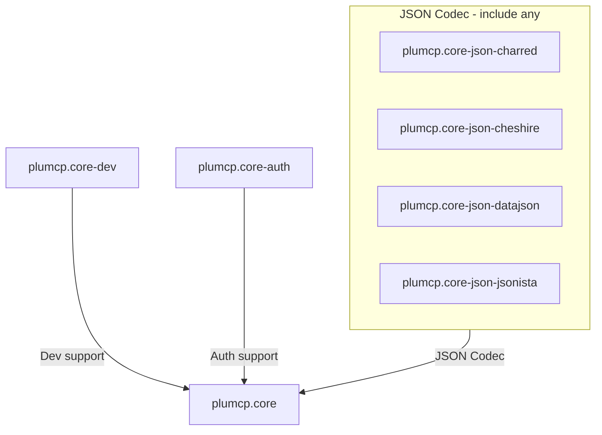

# Dependencies

Platform (Java/Node) dependencies are already covered
in [Installation](installation.md).

## Modules

This project have the following modules:

The root module `plumcp.core` is a common dependency of all other
modules. Every module may have other dependencies to accomplish
respective goals.

## Project dependencies

### Minimum required dependencies

- Clojure 1.12
- `plumcp.core`
- `plumcp.core.json-<any>` (transitively gets `plumcp.core`)

With Leiningen, you get the `:dependencies` (resolved transitively) as
specified in `project.clj`. With Shadow-CLJS, you get Clojure 1.12 and
ClojureScript 1.12 out of the box.

##### Why JSON-codec?

The Java platform does not include any JSON API, so you would need
one of the JSON codec modules beside the `plumcp.core` module. This
also applies to ClojureScript apps, though JavaScript hosts natively
support JSON, because the CLJS compiler runs in the Java platform.

## Module dependencies

This library includes the following modules

- plumcp.core
    - Clojure/ClojureScript 1.12 (not pulled in)
- plumcp.core-dev (Development support)
    - [bling](https://github.com/paintparty/bling)
    - [malli](https://github.com/metosin/malli)
- plumcp.core-auth (Auth support)
    - Clojure: [jose4j](https://bitbucket.org/b_c/jose4j)
    - ClojureScript: [jose](https://github.com/panva/jose)

## Defaults

### Default HTTP server/client

=== "Clojure"
    - HTTP server: Java Module `jdk.httpserver`
    - HTTP client: Java Package `java.net.http`
=== "ClojureScript"
    - HTTP server: Node.js `http` module
    - HTTP client: JS `fetch` (Browser compatible)

### Traffic Logger

The traffic logger is a protocol implementation. There
are no-op, compact and colourful loggers included for
different purposes. You may supply a logger suitable
for your project in MCP client or server scenario.

### JWT validation (Streamable HTTP + OAuth 2.1)

When opting to use Streamable HTTP with OAuth 2.1, you
may want to use the JWT validation functions in the
`core-auth` module, or any suitable replacement.
