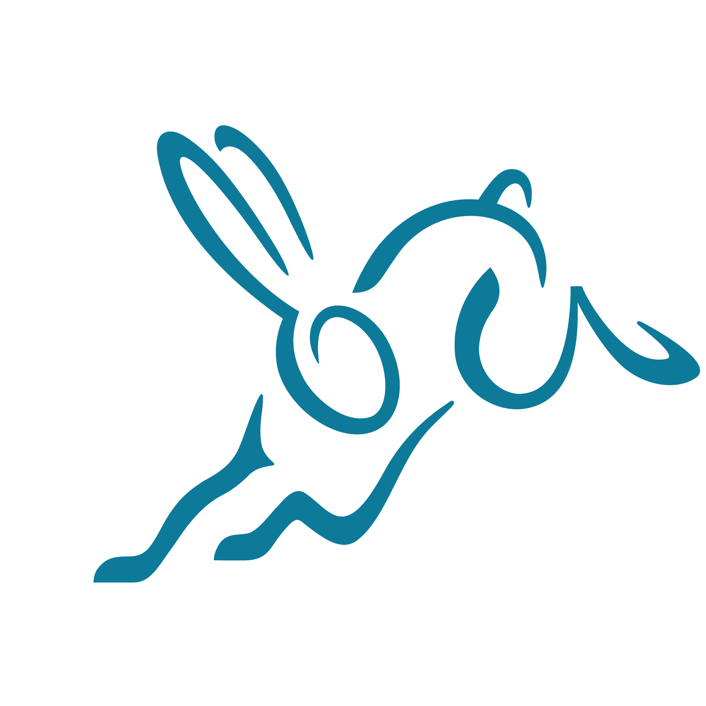

# PluMCP

PluMCP is a low-dependency
[Clojure](https://clojure.org)/[ClojureScript](https://clojurescript.org)
library for making
[Model Context Protocol (MCP)](https://modelcontextprotocol.io/)
clients and servers. Connect your business (data,
process and software) with AI Language Models and
AI Agents using MCP and this library.

??? info inline end "Supported platforms"

    <!-- Logos obtained from https://www.svgrepo.com -->
    
    
    
    
    

## Why consider PluMCP?

- _Complete:_ Enjoy almost all non-deprecated MCP features and transports
- _Reach:_ Clojure/ClojureScript reaches Java/JavaScript eco-systems
- _Ergonomic:_ User-friendly API, automatic error-checking
- _Light:_ Low dependency, Bring your own dependency
- _Flexible:_ Composable design with configurable/overridable defaults
- _Secure:_ OAuth 2.1 integrated with Streamable HTTP transport

## Status 

- _Protocol version:_ 2025-06-18, 2025-03-26 (TODO: 2025-11-25)
- _Protocol implementation:_ Asynchronous, Full-duplex, Concurrent
- _Features:_ All non-deprecated client/server features supported
- _Transports:_ STDIO, Streamable HTTP (optionally with OAuth 2.1)

### Transports

| Platform                         | STDIO | Streamable HTTP | Streamable HTTP+OAuth 2.1 |
| -------------------------------- | ----- | --------------- | ------------------------- |
| Clojure/JVM MCP server           | Yes   | Yes             | Yes                       |
| Clojure/JVM MCP client           | Yes   | Yes             | Yes                       |
| ClojureScript/NodeJS MCP server  | Yes   | Yes             | Yes                       |
| ClojureScript/NodeJS MCP client  | Yes   | Yes             | Yes                       |
| ClojureScript/Browser MCP client | --    | Yes             | With customization only   |

# License

Copyright © 2025-2026 Shantanu Kumar

This program and the accompanying materials are made available under the
terms of the Eclipse Public License 1.0 which is available at
https://www.eclipse.org/legal/epl/epl-v10.html.
