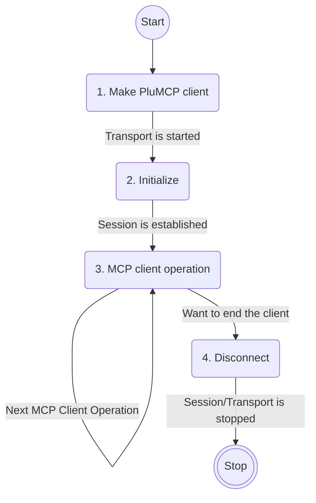

# PluMCP Client

The PluMCP client workflow:



The PluMCP Client API is contained in the `plumcp.core.api.mcp-client`
namespace. Remainder of this page assumes you have these aliases setup.

```clojure
(ns app.core
  (:require [plumcp.core.api.entity-support :as es]
            [plumcp.core.api.mcp-client :as mc]
            [plumcp.core.client.http-client-transport :as hct]
            [plumcp.core.client.stdio-client-transport :as sct]
            [plumcp.core.support.http-client :as hc]))
```


## 1. Make PluMCP client

```clojure
(def client-info (es/make-info "My MCP app" "0.1.0"))

(def stdio-transport
  (sct/run-command {:command-tokens ["run-mcp-server"]}))

(def http-transport
  (hct/make-streamable-http-transport
   ((hc/make-http-client "http://localhost:3000/mcp"))))

(def client-transport http-transport)  ; or stdio-transport

(def the-client (mc/make-client {:info client-info
                                 :client-transport client-transport}))
```

## 2. Initialize the client

MCP client initialization needs to be followed up with a notification
of initialization, which you can do as follows:

```clojure
(mc/initialize-and-notify! the-client)
```

If you want control over how/when notification happens, or you want to
perform some step before sending notification, you may use the lower
level API:

```clojure
(mc/initialize! the-client
                (fn [result]
                  (mc/notify-initialized the-client)))
```

## 3. MCP Client operation

The MCP Client operations have their corresponding API. Some of the API
calls that accept client and a handler function as argument are shown
below:

| MCP Client Operation        | Client API call              | Arguments          |
|-----------------------------|------------------------------|--------------------|
| List MCP prompts            | `mc/list-prompts`            | `[client handler]` |
| List MCP resources          | `mc/list-resources`          | `[client handler]` |
| List MCP resource templates | `mc/list-resource-templates` | `[client handler]` |
| List MCP tools              | `mc/list-tools`              | `[client handler]` |
| Get MCP prompt              | `mc/get-prompt`              | `[client handler]` |
| Read MCP resource           | `mc/read-resource`           | `[client handler]` |
| Call MCP tool               | `mc/call-tool`               | `[client handler]` |
| Complete (Completion)       | `mc/complete`                | `[client handler]` |
| Ping                        | `mc/ping`                    | `[client handler]` |

!!! note "Note!"

    This is a selected list of API calls - for exhaustive list check the
    source in `plumcp.core.api.mcp-client` namespace.

For example, you can print the list the MCP tools as follows:

```clojure
(mc/list-tools the-client (fn [tools]
                            (println "Tools" tools)))
```

The `handler` is an arity-1 callback function that is invoked after the
response for the client request arrives.

## 4. Disconnect the client

Disconnection of the client, which stops the transport, is quite
straightforward:

```clojure
(mc/disconnect! the-client)
```

!!! warning "Don't forget to disconnect"

    Failing to disconnect the PluMCP client may keep the client
    transport running, holding on to resources, hence preventing
    cleanup.